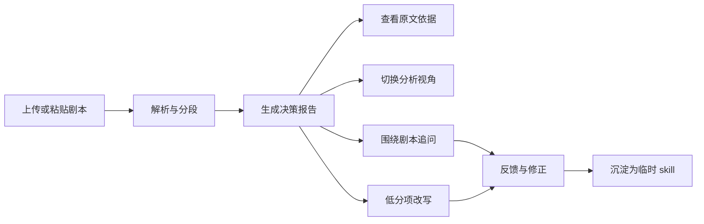

# ScriptLens 产品设计

## 1. 产品定位

ScriptLens 是一个面向短剧、网文、影视内容场景的剧本理解 Agent。

它解决的不是"把剧本总结短一点",而是:

- 帮用户快速判断是否值得继续看。
- 帮用户快速定位重点段落。
- 帮用户理解人物、冲突、看点和风险。
- 帮用户围绕剧本继续追问。
- 帮用户对低质量片段进行定向优化。

一句话定位:

> 让陌生长剧本在 3 分钟内变成可判断、可追问、可定位、可改写的内容资产。

## 2. 目标用户

默认服务所有题目中列出的内容岗位,但产品层按视角组织:

- **总览视角**:给所有用户一个快速判断。
- **选品视角**:关注是否值得推进、核心卖点、风险。
- **编剧/策划视角**:关注结构、人物动机、冲突、改写空间。
- **运营/投放视角**:关注钩子、爽点、反转、切片点。
- **审核/风控视角**:关注敏感内容、伦理风险、理解障碍。

视角切换影响信息排序和解释方式,不改变底层事实。

## 3. 核心用户流程

## 4. 首屏体验

用户打开产品后看到:

- 产品一句话说明:"上传剧本,3 分钟获得可验证的剧本 coverage。"
- 上传区:支持 `.txt`、粘贴文本。
- 示例入口:一键加载 `samples/xiaoqie.txt`。
- 说明卡片:输出包括决策报告、原文依据、视角分析、改写建议。

首屏目标:

- 评估方不需要读 README 就能开始体验。
- 30 秒内知道产品解决什么问题。
- 降低上传门槛,保证 demo 可跑通。

## 5. 解析中状态

解析过程要让用户知道 Agent 在做什么:

- Step 1:读取文本并识别结构。
- Step 2:切分剧情片段。
- Step 3:抽取人物、事件、冲突和看点。
- Step 4:生成报告与评分。
- Step 5:建立证据索引。

解析中可以显示进度和当前阶段,但不做假进度条。失败时明确告诉用户失败位置和原因。

## 6. 报告页布局

推荐左右布局:

- 左侧:原文阅读器。
- 右侧:分析报告、视角切换、聊天、改写。

左侧原文阅读器:

- 按段落/章节显示。
- 保留行号或段落号。
- 支持证据高亮。
- 点击报告里的证据,自动滚动到对应段落。

右侧分析区:

- 顶部:决策卡片。
- 中部:分层报告。
- 底部:追问与改写入口。

## 7. 输出层级

### 7.1 30 秒层:决策卡片

目的:回答"值不值得继续看"。

字段:

- `decision`:推荐继续 / 谨慎继续 / 不建议继续。
- `confidence`:高 / 中 / 低。
- `one_sentence_reason`:一句话理由。
- `top_value`:最大价值。
- `top_risk`:最大风险。
- `must_read`:最值得优先看的 3 个片段。

设计原则:

- 不讲长篇道理。
- 明确判断。
- 每个判断可点证据。

### 7.2 3 分钟层:核心理解

目的:快速建立有效认知。

模块:

- 核心主线。
- 主要人物与关系。
- 关键冲突。
- 钩子、反转、爽点。
- 节奏与前半段吸引力。
- 问题与风险。
- 评分总览。

### 7.3 10 分钟层:完整 coverage

目的:形成可讨论、可推进的专业分析。

模块:

- 剧情节点时间线。
- 人物弧光与动机。
- 冲突升级链。
- 看点分布。
- 情绪/节奏曲线。
- 风险分级。
- 视角报告。
- 改写建议。

### 7.4 深入层:证据和追问

目的:让用户验证和继续探索。

能力:

- 点击任意结论查看证据。
- 追问人物/剧情/风险/卖点。
- 要求定位原文。
- 对局部片段做改写。
- 给反馈并修正报告。

## 8. 评分设计

评分展示不追求伪精确,而追求帮助判断。

推荐维度:

- 主线清晰度。
- 人物动机可信度。
- 冲突强度。
- 钩子/爽点密度。
- 节奏控制。
- 商业/传播潜力。
- 风险等级。

每个分数必须有:

- 评分。
- 简短理由。
- 关键证据。
- 改进建议。

风险等级反向展示:

- 低风险:可推进。
- 中风险:需要复核。
- 高风险:不建议直接推进。

## 9. 视角切换

### 9.1 总览视角

面向所有用户,默认展示:

- 决策建议。
- 核心主线。
- 人物冲突。
- 看点风险。
- 综合评分。

### 9.2 选品视角

优先展示:

- 是否值得继续看。
- 市场/传播潜力。
- 题材识别度。
- 前半段吸引力。
- 推进风险。
- 推荐下一步:继续读、请编剧评估、放弃、改稿后再看。

### 9.3 编剧/策划视角

优先展示:

- 结构完整度。
- 人物动机。
- 冲突强度。
- 伏笔回收。
- 可改写段落。
- 改写建议。

### 9.4 运营/投放视角

优先展示:

- 开篇钩子。
- 情绪爽点。
- 反转节点。
- 可切片片段。
- 标题/卖点提炼。
- 前 3 分钟吸引力。

### 9.5 审核/风控视角

优先展示:

- 暴力、低俗、伦理、价值观风险。
- 版权或平台敏感点。
- 理解障碍。
- 高风险原文片段。
- 风险处理建议。

## 10. 证据定位体验

每个关键结论旁边显示"查看依据"。

点击后:

- 左侧原文滚动到对应段落。
- 证据片段高亮。
- 右侧显示该证据支持的具体结论。
- 如果证据不充分,标记为"低置信判断"。

证据类型:

- 直接证据:原文明确说明。
- 间接证据:需要结合前后文推断。
- 弱证据:可疑但不足以强判断。

用户界面只把直接证据作为强结论依据。

## 11. 多轮追问体验

聊天区不是泛用聊天框,而是剧本问答 Agent。

预设问题:

- 这部剧最值得看的地方是什么?
- 前半段为什么抓人或不抓人?
- 主角的动机成立吗?
- 最大的反转在哪里?
- 哪些段落适合投放切片?
- 哪些问题会影响推进?
- 如果要改,先改哪里?

回答格式:

- 直接答案。
- 原文依据。
- 置信度。
- 可继续操作:查看片段 / 改写 / 加入重点。

## 12. 改写体验

改写入口来自两处:

- 评分低项。
- 用户选中的原文片段。

改写流程:

1. 用户选择目标:增强钩子 / 补动机 / 强化冲突 / 压缩节奏 / 降低风险。
2. 系统展示原问题和依据。
3. 系统生成改写版本。
4. 系统说明改了什么、为什么这样改。
5. 用户可接受、重试、反馈。

改写输出:

- 原文问题。
- 改写目标。
- 改写文本。
- 改动说明。
- 预期提升维度。
- 仍需人工判断的风险。

## 13. 反馈与 skill 进化

反馈入口:

- "这个判断不准"。
- "遗漏了关键人物"。
- "我更关心投放视角"。
- "以后分析这类文本时加上审核风险"。
- "把这个分析视角保存成 skill"。

反馈结果:

- 当前报告标记修正。
- 后续追问使用修正信息。
- 可保存临时 skill。
- skill 在侧边栏可见。

Skill 示例:

- 短剧前三分钟钩子检查。
- 女频爽点密度分析。
- 人物动机漏洞检查。
- 平台审核风险检查。

## 14. 空状态和失败状态

空状态:

- 展示示例剧本。
- 展示产品能力。
- 提供一键试用。

失败状态:

- 文本过短:提示至少输入一定长度。
- 解析失败:说明失败阶段。
- 模型超时:允许重试。
- 证据不足:报告中标注低置信。

不允许:

- 失败后返回空白页。
- 返回看似完整但无证据的报告。
- 静默吞掉上传或解析错误。

## 15. Demo 体验脚本

评估方 5 分钟路径:

1. 打开线上 demo。
2. 点击"加载示例剧本"。
3. 等待报告生成。
4. 查看决策卡片:是否值得继续看。
5. 点击"关键反转",左侧跳到原文。
6. 切换"投放视角",查看可切片片段。
7. 追问"陆寻为什么赶走秀秀?"。
8. 点击一个低分项,生成改写建议。
9. 提交反馈:"这个样本更像网文短篇"。
10. 查看报告如何根据反馈调整表述或视角。

这条路径覆盖输入、输出、交互、依据、视角、改写、skill 进化和前端展示。

## 16. 产品成功标准

用户体验成功:

- 用户 30 秒内知道是否继续看。
- 用户 3 分钟内知道主线、人物、看点和风险。
- 用户能点开任何关键判断的依据。
- 用户能围绕剧本继续追问。
- 用户能看到低分项如何被改写。

面试评估成功:

- 评估方能看出这不是普通摘要。
- 评估方能实际操作完整 Agent 链路。
- 评估方能看到六个加分项的证据。
- 评估方能理解你的设计取舍。
