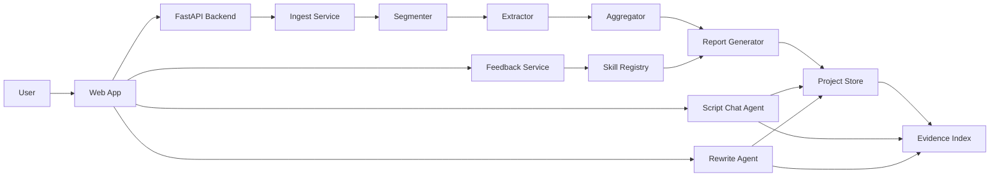

# ScriptLens 架构设计

## 1. 架构目标

架构只服务 `docs/source/task.md` 的交付目标:

- 输入长剧本。
- 输出结构化分析。
- 支持交互追问。
- 支持查看依据。
- 支持视角切换。
- 支持迭代修正。
- 支持评估、部署、前端展示和加分项。

架构原则:

- 先满足真实需求,不为想象中的未来复杂度设计。
- 核心判断必须可追溯到原文。
- Agent 能力必须体现为可观察的工具调用和状态变化。
- 结构化输出优先于自由文本。
- 评估和产品功能共用同一套数据契约。

## 2. 总体架构



## 3. 模块边界

### 3.1 Web App

职责:

- 上传/粘贴剧本文本。
- 展示解析进度。
- 展示报告、评分、证据、时间线、人物关系。
- 支持视角切换。
- 支持追问、改写、反馈。

不负责:

- 不在前端做业务判断。
- 不在前端拼 prompt。
- 不在前端保存敏感配置。

### 3.2 API Backend

职责:

- 暴露 HTTP API。
- 管理项目、剧本、分析任务。
- 调用 Agent 工具链。
- 返回结构化数据。
- 管理错误和状态。

不负责:

- 不把所有逻辑堆到 controller。
- 不在接口层散落模型调用。

### 3.3 Ingest Service

职责:

- 接收原始文本。
- 识别标题、作者、简介、正文。
- 清理明显噪音。
- 保留原文行号、字符位置。

输出:

- `ScriptDocument`
- `RawSpan`

失败边界:

- 文本为空或过短,直接拒绝。
- 编码无法解析,返回明确错误。
- 不静默返回空文档。

### 3.4 Segmenter

职责:

- 将长文本切成可分析片段。
- 优先使用章节/场景/分集标记。
- 无显式结构时使用语义和长度兜底。
- 每个片段保留原文范围。

输出:

- `ScriptSegment[]`

关键规则:

- 不能丢原文。
- 不能合并到无法定位证据的粒度。
- 对 `samples/xiaoqie.txt` 这类文本,数字段落可作为天然 segment。

### 3.5 Extractor

职责:

- 对每个 segment 抽取结构化信息。
- 提取人物、事件、冲突、情绪、钩子、风险。
- 为局部判断绑定证据。

输出:

- `SegmentAnalysis[]`

失败边界:

- 单段抽取失败不能伪造成正常结果。
- 可重试有限次数。
- 失败段落在报告中标记为未解析,不静默跳过。

### 3.6 Aggregator

职责:

- 聚合局部分析。
- 生成全局主线、人物关系、冲突链、看点分布、风险清单。
- 去重、合并、处理冲突结论。

输出:

- `GlobalAnalysis`

关键规则:

- 任何全局判断都必须能追溯到 segment evidence。
- 冲突结论不能强行覆盖,要保留低置信标记。

### 3.7 Report Generator

职责:

- 生成用户可读的 coverage report。
- 生成不同视角的报告重排。
- 生成 scorecard。
- 生成 must-read 段落。

输出:

- `ScriptReport`

关键规则:

- 输出必须符合 schema。
- 不允许生成无证据强结论。
- 分数必须带理由和 evidence refs。

### 3.8 Evidence Index

职责:

- 保存原文片段和元数据。
- 支持按人物、事件、关键词、语义检索。
- 支持前端点击定位。

MVP 实现:

- 段落级索引。
- 简单关键词 + embedding 检索。
- 证据 refs 指向 `segment_id` 和 `span_id`。

### 3.9 Script Chat Agent

职责:

- 处理用户追问。
- 判断问题类型。
- 检索证据。
- 基于剧本回答。
- 返回答案、依据、置信度和后续操作。

禁止:

- 无证据强答。
- 编造原文不存在的剧情。
- 把泛用写作建议当作剧本分析。

### 3.10 Rewrite Agent

职责:

- 基于低分项或用户选中片段生成改写。
- 明确改写目标。
- 保留核心设定。
- 输出改写说明和预期改善。

不负责:

- 不重写整部剧。
- 不自动覆盖原文。
- 不承诺商业效果。

### 3.11 Feedback Service

职责:

- 接收用户反馈。
- 标记报告结论修正。
- 更新当前项目上下文。
- 可生成临时 skill。

输出:

- `FeedbackRecord`
- `SkillDraft`

### 3.12 Skill Registry

职责:

- 保存分析 skill。
- 将 skill 转成视角、评分维度、prompt 片段和输出字段。
- 在报告或问答中按需应用。

MVP skill 形式:

```json
{
  "id": "short_drama_hook_auditor",
  "name": "短剧前三分钟钩子检查",
  "purpose": "检查开篇是否有足够钩子、冲突和反转",
  "dimensions": ["opening_hook", "conflict_pressure", "reversal"],
  "output_sections": ["hook_score", "weak_spans", "rewrite_suggestions"]
}
```

## 4. 核心数据契约

### 4.1 ScriptDocument

```json
{
  "id": "script_001",
  "title": "小妾",
  "source_type": "web_novel",
  "raw_text": "...",
  "metadata": {
    "author": "清楂茶花",
    "category": "古代言情"
  },
  "created_at": "..."
}
```

### 4.2 ScriptSegment

```json
{
  "id": "seg_001",
  "script_id": "script_001",
  "label": "1",
  "start_line": 16,
  "end_line": 42,
  "start_char": 120,
  "end_char": 950,
  "text": "..."
}
```

### 4.3 EvidenceRef

```json
{
  "id": "ev_001",
  "segment_id": "seg_001",
  "start_line": 29,
  "end_line": 42,
  "quote": "一柄长戟挑开草垛...",
  "support_type": "direct"
}
```

### 4.4 SegmentAnalysis

```json
{
  "segment_id": "seg_001",
  "summary": "女主被家人抛弃后遭遇胡人屠村,被周通救下并带走。",
  "characters": ["秀秀", "周通", "胡人士兵"],
  "events": ["被家人抛弃", "胡人屠村", "周通救人"],
  "conflicts": ["生存危机", "战争暴力", "女性处境"],
  "hooks": ["开篇极端生存危机", "救命男人登场"],
  "risks": ["暴力和性侵相关内容需要审核"],
  "evidence_refs": ["ev_001"]
}
```

### 4.5 ScriptReport

```json
{
  "decision": {
    "level": "consider",
    "confidence": "medium",
    "reason": "开篇钩子强,但前段暴力与性风险较高,需要审核和定位改写。"
  },
  "core_plot": "...",
  "characters": [],
  "conflicts": [],
  "hooks": [],
  "risks": [],
  "scorecard": {},
  "perspectives": {},
  "must_read_segments": [],
  "evidence_refs": []
}
```

## 5. API 设计

MVP API:

- `POST /api/scripts`:上传剧本。
- `POST /api/scripts/{script_id}/analyze`:启动分析。
- `GET /api/scripts/{script_id}/report`:获取报告。
- `GET /api/scripts/{script_id}/segments`:获取原文分段。
- `POST /api/scripts/{script_id}/chat`:围绕剧本追问。
- `POST /api/scripts/{script_id}/rewrite`:改写片段。
- `POST /api/scripts/{script_id}/feedback`:提交反馈。
- `GET /api/scripts/{script_id}/skills`:查看当前 skill。
- `POST /api/eval/run`:触发评估。

## 6. 状态模型

分析任务状态:

- `created`
- `ingesting`
- `segmenting`
- `extracting`
- `aggregating`
- `reporting`
- `indexing`
- `completed`
- `failed`

失败时必须保存:

- 失败阶段。
- 错误类型。
- 可重试标记。
- 用户可读说明。

## 7. 存储设计

MVP 可用 SQLite:

- `scripts`:剧本元数据和原文。
- `segments`:分段文本和范围。
- `analyses`:segment/global/report JSON。
- `evidence_refs`:证据片段。
- `chat_messages`:追问记录。
- `rewrite_records`:改写记录。
- `feedback_records`:用户反馈。
- `skills`:skill 配置。
- `eval_runs`:评估结果。

如果部署时并发较低,SQLite 足够。若后续需要多人并发和云部署稳定性,再切 Postgres。

## 8. Prompt 与 Schema

Prompt 管理:

- `prompts/extract_segment_v1.md`
- `prompts/aggregate_report_v1.md`
- `prompts/chat_answer_v1.md`
- `prompts/rewrite_segment_v1.md`
- `prompts/judge_eval_v1.md`

Schema 管理:

- 所有 LLM 输出先走结构化 schema。
- schema 变更必须同步 eval。
- 前端只消费稳定 schema,不解析自由文本。

## 9. 观测与评估

每次分析记录:

- 输入长度。
- segment 数量。
- LLM 调用次数。
- 每阶段耗时。
- 失败次数。
- 报告字段完整率。
- evidence 覆盖率。

评估脚本复用同一套 pipeline,不能单独写一套评估逻辑。

## 10. 部署架构

MVP 部署:

- Web:Vercel 或同类平台。
- API:Render/Fly.io/Railway/云服务器。
- DB:SQLite 文件或 Postgres。
- Object storage:非必须,文本先存 DB。
- Env:LLM API key、model、database URL。

线上 demo 要求:

- 示例剧本可直接加载。
- 上传文本可跑通。
- 错误可见。
- 不暴露 API key。

## 11. 失败边界

### 11.1 输入失败

- 空文本、过短文本:拒绝。
- 文件类型不支持:提示。
- 编码错误:提示重新上传。

### 11.2 分析失败

- segment 抽取失败:标记失败段落,允许重试。
- report 生成失败:不返回半成品强结论。
- LLM 超时:可重试。

### 11.3 证据不足

- 降低置信度。
- 标为"需要人工复核"。
- 不作为强推荐依据。

### 11.4 改写失败

- 不返回空改写。
- 告诉用户失败原因。
- 保留原文不被覆盖。

## 12. 后续 build 顺序

实现阶段按以下顺序:

1. 数据模型和 API skeleton。
2. 上传、分段、存储。
3. segment 抽取。
4. 聚合和报告。
5. evidence refs 和前端联动。
6. chat agent。
7. scorecard 和 eval。
8. rewrite agent。
9. feedback skill。
10. 部署和打磨。

这个顺序确保每一步都能被 demo 和评估验证。
