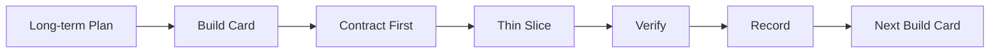

# Plan-Build-Verify-Record 工程 SOP

## 1. 目的

这份 SOP 用于指导 ScriptLens 从设计文档进入可运行工程,也用于后续 D4-D10 和未来 Agent 项目复用。

核心目标:

- 避免文档瀑布:一直写设计,迟迟没有可运行结果。
- 避免无约束 vibe coding:代码写到哪算哪,最后偏离需求。
- 把每次迭代压成可验证的最小增量。
- 把成功经验沉淀成可复用流程。

## 2. 第一性原理

工程项目的本质不是"写更多代码",也不是"写更多文档",而是持续缩小需求和可运行系统之间的差距。

每一轮迭代都必须回答:

- 这轮解决哪个真实用户问题?
- 最小可运行链路是什么?
- 输入、输出和数据契约是什么?
- 如何证明它真的跑通?
- 本轮明确不做什么?
- 实现结果是否改变了原有判断?

## 3. 标准循环



### 3.1 Plan

长期文档定义方向、约束和取舍。

适用文件:

- `docs/01-requirements.md`
- `docs/02-evaluation.md`
- `docs/03-competitor-scan.md`
- `docs/04-solution-research.md`
- `docs/05-product-design.md`
- `docs/06-architecture.md`
- `docs/07-bonus-plan.md`
- `docs/08-delivery-plan.md`
- `docs/09-engineering-rules.md`
- `docs/10-tech-stack-decision.md`

长期文档不应在每个小实现中频繁改动。只有当实现证明原计划错误、技术取舍变化或验收标准变化时才更新。

### 3.2 Build Card

Build Card 是当天或当前增量的执行边界。它必须短,只约束当前要做的事。

每张 Build Card 必须包含:

- 目标。
- 真实输入。
- 最小输出。
- 数据契约。
- 实现步骤。
- 验收方式。
- 本轮不做。
- 风险。
- 完成记录。

Build Card 放在:

```text
docs/build-cards/
```

### 3.3 Contract First

写业务代码前,先定义最小契约:

- 输入模型。
- 输出模型。
- API shape。
- 真实 fixture。
- 错误边界。

Agent 项目尤其不能先让 LLM 自由输出,否则后续前端、评估和证据定位都会失控。

### 3.4 Thin Slice

每轮只打通一条最小垂直链路。

ScriptLens 的垂直链路示例:

- D3:示例剧本 -> 分段 -> 基础报告 -> 前端展示。
- D4:报告结论 -> evidence refs -> 点击定位 -> 基于证据追问。
- D5:segment/report -> scorecard -> eval report。
- D7:低分项 -> 改写目标 -> 改写结果 -> 对比说明。

薄片完成前,不提前做相邻阶段的大功能。

### 3.5 Verify

每轮必须用真实样本验证。

验证优先级:

- 能否本地运行。
- 能否用真实样本跑通。
- 输出是否符合 schema。
- 失败是否可见。
- 是否满足 Build Card 验收项。

不允许只凭"代码看起来对"进入下一轮。

### 3.6 Record

记录不是写流水账,只记录三类内容:

- 本轮完成的可运行能力。
- 计划和现实的偏差。
- 下一轮必须继承的约束。

记录写回当前 Build Card 的"完成记录"部分。

## 4. Build Card 模板

```markdown
# Dn Build Card: <Title>

## Goal

本轮要打通的最小用户价值。

## Inputs

- 真实样本或用户输入。

## Outputs

- 本轮最小输出。

## Contracts

- 输入模型。
- 输出模型。
- API shape。

## Steps

1. ...

## Acceptance

- [ ] ...

## Non-goals

- ...

## Risks

- ...

## Verification

```bash
...
```

## Record

### Done

### Deviations

### Carry-over
```

## 5. 文档更新规则

### 5.1 需要更新长期文档

出现以下情况时更新长期文档:

- 技术选型变化。
- 模块边界变化。
- 用户体验变化。
- 评估指标变化。
- 加分项实现路径变化。
- 实现证明原计划错误。

### 5.2 只更新 Build Card

以下情况只更新当前 Build Card:

- 当天完成了哪些功能。
- smoke test 结果。
- 小范围实现偏差。
- 下一轮注意事项。

### 5.3 不写文档

以下情况不额外写文档:

- 简单重命名。
- 小 bug 修复。
- 样式微调。
- 不改变接口和行为的内部整理。

## 6. Done 标准

每轮结束前必须满足:

- 有可运行结果。
- 用真实样本验证过。
- 关键输出符合 schema。
- 失败路径不静默。
- Build Card 验收项已勾选或明确说明未完成原因。
- 下一轮目标清楚。

## 7. 反模式

### 7.1 文档瀑布

表现:

- 每个细节都先写长文档。
- 连最小 demo 都没有。
- 讨论持续增加,系统不增长。

纠正:

- 写 Build Card。
- 只做最小垂直链路。
- 用真实样本验证。

### 7.2 无约束 vibe coding

表现:

- 没有当天目标。
- 没有 schema。
- LLM 输出自由文本。
- 前端跟着临时字段写。
- 功能越来越多,主链路没跑通。

纠正:

- Contract first。
- 每轮只做一个 thin slice。
- 不满足验收不进入下一轮。

### 7.3 无证据报告

表现:

- 报告看起来完整。
- 结论无法回原文。
- 用户无法判断是否可信。

纠正:

- evidence refs 进入核心数据契约。
- 无证据结论降级为低置信。

### 7.4 过早基础设施

表现:

- 一开始引入 Celery、Milvus、复杂部署、登录系统。
- 核心 Agent 能力没做完。

纠正:

- 优先 SQLite、进程内任务、段落级索引。
- 等真实瓶颈出现再升级。

## 8. ScriptLens D3-D10 复用方式

- D3:仓库初始化 + 最小报告链路。
- D4:证据定位 + 多轮问答。
- D5:Scorecard + Eval。
- D6:前端报告页。
- D7:低分项改写。
- D8:Feedback Skill。
- D9:部署和提交材料。
- D10:打磨、评估、录屏。

每天开始前先写当天 Build Card,当天结束前更新 Record。

## 9. 未来项目复用方式

未来任何 Agent 项目都可以套用:

1. 需求文档拆解。
2. 技术选型决策。
3. Build SOP。
4. 每轮 Build Card。
5. Contract first。
6. Thin slice。
7. Smoke test。
8. Record。

这个 SOP 的价值不是让流程变重,而是让 AI 辅助开发保持方向、边界和验收。
