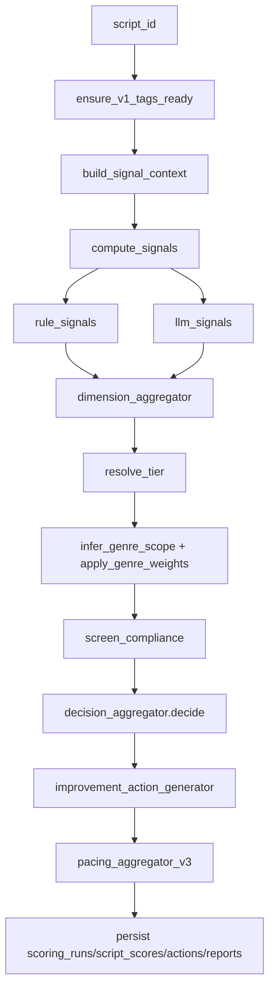

> **DEPRECATED — 2026-05-31**
>
> 本文档描述的 Batch3 评分链路（`score_registry` + `rubric_sets/v3.yaml` +
> `tag_pipeline` 全剧抽情节打标签 + signal_aggregator + decision_aggregator）已被
> [2026-05-31-投资决策评分框架-v4.md](2026-05-31-投资决策评分框架-v4.md) 取代。
>
> 历史时间线：
> - 2026-05-27 Batch3 上线，与 `tag_pipeline` 强耦合，单部剧报告耗时 30+ 分钟
> - 2026-05-29 release/v1-mvp 评分回归 self-contained 规则评分（`dimension_scorer.py` 6 维）
> - 2026-05-31 v4 推翻重做，重写为 "5 维 + 合规 gate + YAML rubric + gated multiplicative" 框架
>
> Batch3 时代的 `score_registry/` / `tag_pipeline/` / `dimension_aggregator/` /
> `decision_aggregator/` / `signal_catalog/` / `evaluation_chain/` / `bundle_extractor/` 等
> 模块全部进入 dead-code 隔离区，下次 cleanup PR 统一删除。
>
> **本文档保留作为 Batch3 阶段决策记录**，不再作为评分链路实现依据。
> v4 新链路目录见 `ScriptLens/backend/app/service/scoring/`。

---

# 2026-05-27 Batch3 评分链路落地决策（已废弃）

更新时间：2026-05-27

## 1. 背景与目标

### 1.1 与 05-26 顶层设计稿的关系

- `docs/2026-05-26-剧本评分设计决策.md` 负责“评分体系定义与目标形态”。
- 本文档负责“Batch 3 在真实代码中的实现决策、偏离说明与后续演进边界”。
- 后续改评分主链，优先更新本文档，再回写顶层设计稿。

### 1.2 与 Batch 2 schema-driven 范式对称关系

- Batch 2：`tag_registry` + `tag_sets/*.yaml` + bundle extractor + compat check。
- Batch 3：`score_registry` + `rubric_sets/*.yaml` + signal aggregator + compat check。
- 两侧都采用“配置注册 + 版本化 + 兼容门禁 + 稳定性生命周期”。

## 2. 架构总览

### 2.1 数据流图（主链路）



### 2.2 generate_report before / after

```mermaid
flowchart LR
    subgraph Before[v2 MVP 主链]
      A1[reward_extractor] --> A2[dimension_scorer]
      A3[beat_chain] --> A2
      A4[character_graph_chain] --> A2
      A5[coverage_chain] --> A2
      A2 --> A6[decision]
    end

    subgraph After[v3 Batch3 主链]
      B1[signal_catalog(rule+llm)] --> B2[dimension_aggregator]
      B2 --> B3[tier + genre weighting]
      B3 --> B4[compliance + decision]
      B4 --> B5[improvement_actions + pacing_curve_v3]
      B5 --> B6[persist]
    end
```

### 2.3 Batch 2 ↔ Batch 3 对称表

| Batch 2 标签层 | Batch 3 评分层 |
| --- | --- |
| `tag_registry/tag_sets/*.yaml` | `score_registry/rubric_sets/*.yaml` |
| `bundle_extractor` | `dimension_aggregator` |
| `check_tagset_compat.py` | `check_rubric_compat.py` |
| `stability_state` | `rubric_versions.status` |
| `tag_set_ver` | `rubric_version + score_ver` |

## 3. 关键工程取舍（落地反推设计）

### 3.1 新表数收敛（7 -> 3）

- 设计原稿：评分域按信号/维度/决策拆分多张实体表。
- 落地做法：仅新增 `rubric_versions / scoring_runs / scoring_improvement_actions`，其余结果合并到 `script_scores.signals` 与 `reports.decision_payload`。
- 偏离理由：读取路径以“按剧读取整包报告”为主，JSONB 更稳、迁移成本更低。
- 回头条件：出现高频跨剧信号级查询需求时，再拆分明细表并加物化层。

### 3.2 `level` 退役，统一 `tier` 五档

- 设计原稿：存在 level/tier 双语义并行风险。
- 落地做法：统一 `excellent/good/weak/poor/insufficient`，并在前后端 DTO 同步。
- 偏离理由：避免双梯度导致决策与 UI 分歧。
- 回头条件：若要增加“可信度档位”，只在 `confidence` 扩展，不恢复 `level`。

### 3.3 pacing 口径切换到 plot_unit 强度序列

- 设计原稿：节奏强调事件密度与中段塌陷。
- 落地做法：废弃 `scene event_count`，改 `narrative_intensity` 序列聚合。
- 偏离理由：plot_unit 是标签层稳定对象，跨脚本对齐更可靠。
- 回头条件：若镜头级数据成熟，可增加 video-aware pacing 分支但不替代 plot_unit 主口径。

### 3.4 旧链路模块退出评分主链

- 设计原稿：保留历史模块映射关系。
- 落地做法：`reward_extractor/beat_chain/character_graph_chain/coverage_chain` 退出主评分链，仅做聊天/兜底能力。
- 偏离理由：避免重复计算与证据重复加权。
- 回头条件：若某模块形成可验证独立信号，再注册进 signal_catalog。

### 3.5 主链自动补齐 v1 标签依赖

- 设计原稿：并行边界强调上游依赖。
- 落地做法：`generate_report` 首步固定 `ensure_v1_tags_ready`。
- 偏离理由：避免调用侧自行保证依赖导致的运行不一致。
- 回头条件：若上游改为事件驱动预计算，可切为“只校验不补齐”模式。

### 3.6 改写链路改为 action-driven

- 设计原稿：改写建议由低分信号触发模板。
- 落地做法：`improvement_action_generator` 产出动作，`rewrite_chain` 直接消费动作表。
- 偏离理由：保证改写计划可追溯到具体 signal + evidence。
- 回头条件：若引入人工编辑动作，需要增加动作状态与审核字段。

### 3.7 percentile 冷启动采用 industry_proxy

- 设计原稿：tier 由题材分位点锚定。
- 落地做法：冷启动阶段允许 industry_proxy cut，样本不足不阻塞链路。
- 偏离理由：避免初期全量 `insufficient`。
- 回头条件：题材金标达标后切换 verified percentile cut 并回写版本。

### 3.8 narrative_intensity 公式硬编码并锁单测

- 设计原稿：要求公式化且可复现。
- 落地做法：`signal_catalog.rule_signals.pacing` 内固定公式 + 单元测试锁定。
- 偏离理由：减少不同路径重复实现导致漂移。
- 回头条件：调整公式必须同步改测试、文档与报告口径。

### 3.9 character_graph 与实体关系双轨取舍

- 设计原稿：人物关系可来自链式推理。
- 落地做法：评分主链统一消费 `character_entities + character_relationships` 持久化结果。
- 偏离理由：数据库对象更稳定、可复现。
- 回头条件：若图模型输出具备稳定 schema，可作为候选 signal source。

### 3.10 `tag_set_ver` 与 `rubric_version` 双版本绑定

- 设计原稿：强调上游/下游版本可追溯。
- 落地做法：`scoring_runs` 同时记录 `tag_set_ver` 与 `rubric_version`。
- 偏离理由：同一脚本可能多次抽标与多次评分，需要明确组合版本。
- 回头条件：无，作为长期强约束保留。

## 4. Schema 落地实测形态

### 4.1 新增表 DDL（来自 `06_add_scoring_v3.py`）

- `scriptlens.rubric_versions`
- `scriptlens.scoring_runs`
- `scriptlens.scoring_improvement_actions`

### 4.2 `script_scores` 列变更

- 新增：`run_id`, `primary_dimension`, `coverage_ratio`
- `signals` JSONB 子结构（按 signal_key 存 value/score/source/confidence/evidence_refs）
- 维持维度级主键约束：`(script_id, dimension, tag_set_ver, score_ver)`

### 4.3 `reports.decision_payload` 结构

典型字段：

- `overall_score`
- `poor_dimensions`
- `core_poor_dimensions`
- `compliance_status`
- `weighted_scores`
- `raw_decision`

### 4.4 `scoring_runs` 与 `tag_extraction_runs` 的关系

- 同一 script 可有多条 `tag_extraction_runs`（不同 seed/variant）。
- 一个 `scoring_run` 只绑定一个 `tag_set_ver` 与一个 `rubric_version`。
- 回放时以 `(script_id, tag_set_ver, rubric_version, input_hash)` 作为复现主键组合。

### 4.5 `improvement_templates` 目录与索引规则

- 目录：`backend/app/service/script_tools/improvement_templates/*.yaml`
- 文件名建议与 `signal_key` 对齐，例如 `opening_speed.yaml`
- 每个模板最少包含：`signal_key`, `template_version`, `tiers.{poor|weak}`

## 5. Rubric Registry 操作手册

### 5.1 新增一维（8/10 维实验）

1. 在 `rubric_sets/*.yaml` 新增 dimension + signals + base_weight。
2. 在 `signal_catalog` 注册对应规则/LLM 信号实现。
3. 如有 LLM 信号，补 `llm_bundles` 与 prompt 模板。
4. 跑 `check_rubric_compat.py` 与测试。
5. 跑稳定性脚本后决定状态（industry_proxy/verified）。

### 5.2 新增一个 signal

1. 在 `rule_signals` 或 `llm_signals` 实现信号。
2. 在 rubric YAML 引用并声明 `weight_in_dim/source/primary`。
3. 增加单测（规则边界或 LLM schema）。
4. 跑 `v3_signal_smoke` 与 `run_scoring_stability`。

### 5.3 调整题材乘子

1. 修改 `genre_multiplier`。
2. 跑 `batch3_acceptance` 检查去耦与方差是否恶化。
3. 记录 changelog 并更新 `rubric_versions` 状态。

### 5.4 tier 切点升级流程（industry_proxy -> verified）

1. 收集题材金标评分样本。
2. 重算 `tier_cuts[genre][dimension]` 百分位。
3. 回归验证（tier accuracy / decision agreement）。
4. 升级 rubric 版本并标记 `verified`。

## 6. 复现与稳定性约定

### 6.1 `input_hash` 口径

当前落地口径：

- `script_id`
- `rubric_version`
- `score_ver`
- `tag_set_ver`
- `plot_unit_count`
- `episode_count`

> 备注：后续可按需要扩展到文本哈希与实体主键集合。

### 6.2 5-seed 方差边界

- 综合分方差阈值：`<= 0.05`
- 单维分方差阈值：`<= 0.1`
- 当前 dev 实测（`run_scoring_stability`）：综合 `0.000324`，单维最大 `0.0324`（dialogue），达标。

### 6.3 `llm_cache` 命中条件

核心键包含：

- prompt 文本
- prompt_ver
- model/provider
- seed（若模型支持）
- 任务维度标识

同输入重复评测会优先命中缓存，减少跨轮漂移与成本。

## 7. 与前端契约

### 7.1 六维 ScorecardItemDTO

- `dimension`
- `score`
- `tier`
- `confidence`
- `coverage_ratio`
- `signal_refs`
- `reason`

### 7.2 pacing_curve 字段

- `episode_no`
- `plot_unit_count`
- `intensity_avg`
- `intensity_max`
- `hooks`
- `payoffs`
- `conflicts`
- `drivers_distribution`

### 7.3 RewriteResponse 映射

- 来源：`scoring_improvement_actions` + `evaluation.rewrite_seeds`
- 关键字段：`signal_key / target / action_steps / evidence_refs / estimated_lift`

### 7.4 Chat/SSE 事件对齐

- `score_dimension` 工具事件已包含 `dialogue` 维度
- report rail 按六维渲染 tier/confidence/coverage
- 一键改写入口已从“五维”改为“六维”

## 8. 变更记录

- 2026-05-27 初版：与 Batch 3 实装、评测脚本、文档回写一起提交。
