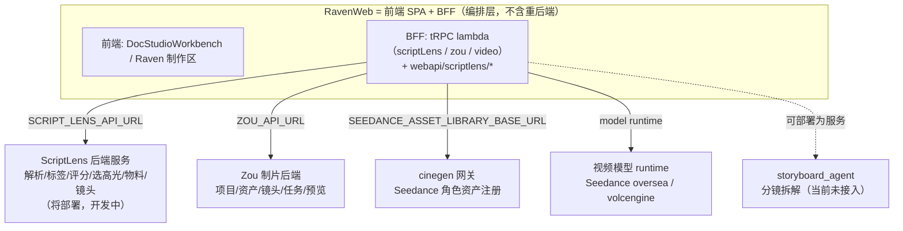

# 剧本到分镜 · 高光集锦投放 · 需求与方案

更新时间：2026-05-29

状态：最终方案。架构已按真实部署拓扑校正，端到端一步到位，不分版本。

---

## 1. 背景与动机

核心判断：

> 决定一个剧本能不能投放的，不是评分本身，而是一段**类似电影预告的「高光集锦」**。先用低成本的高光集锦做投放试探，过了才进入后续的全量制作。

功能目标：在剧本解析完成后，于剧本分析界面**一键产出一条高光集锦视频**，供人判断是否投放；通过后才启动全量制作。

---

## 2. 部署拓扑（先校正认知）

这是理解整套方案的前提。**RavenWeb 不是单体，它只是前端 + BFF；所有重后端都是独立部署的服务，RavenWeb 通过 BFF 编排它们。** 视频现在能生产，正是因为下列后端服务已部署。



要点：

- **ScriptLens 就是其中一个后端服务**，只是还没部署完，不是 RavenWeb 内部模块。
- **编排发生在 RavenWeb BFF 层**：它已经在同时调 ScriptLens（`server/services/scriptLens/client.ts` + `routers/lambda/scriptLens.ts`）、Zou（`routers/lambda/zou.ts`）、cinegen（`server/services/cinegen/seedanceAssetRegistration.ts`）、视频 runtime（`routers/lambda/video/*`）。
- 所以「部署 / serverless」不是本需求的设计难点，而是既定模式。新功能沿用同一套：后端逻辑进 ScriptLens 服务，BFF 加 procedure 透传，出片复用既有服务。

---

## 3. 第一性原理

这条链路只解决一件事：

> **用最小成本，验证一个剧本值不值得全量制作。**

由此推出的硬约束与确定结论：

| 推论 | 确定结论 |
| --- | --- |
| 验证靠预告片式高光，不需要整本成片 | 只对 Top-N 高光段出片，拼成一条集锦 |
| 「哪段是高光」是剧本理解问题 | 高光筛选放 ScriptLens 后端（它独有 `narrative_intensity`/钩子/爽点） |
| 视频模型按「一个 prompt → 一个 5–10s 镜头」工作 | 必须有「高光段 → 多镜头 prompt」的镜头层，逃不掉 |
| 预告张力来自景别/运镜/节奏变化（业界 70% 精力在分镜） | 镜头层产「出片 prompt 序列」，不是 plot_unit 摘要直送 |
| 跨镜头一致性（不崩脸）只能在镜头层落实 | 每个镜头 prompt 绑定角色参考资产 |
| 一致性的根是「角色资产建一次、全程复用」 | 从人物小传出参考图 → 注册 Seedance `character_identity`，整本一次 |
| 编排已是 BFF 的既有职责 | 编排在 RavenWeb BFF，生成在各后端服务；不把出片塞进 ScriptLens |

职责边界：**ScriptLens 后端管「拍什么 + 怎么拍成预告」（选高光 + 物料 + 镜头 prompt）；RavenWeb BFF 编排既有服务把它拍出来并合成集锦。**

---

## 4. 「分镜」这一步的确定形态

争论点不是「要不要分镜」，而是分镜产物长什么样。结论：

> **分镜层的产物 = 镜头级的「出片 prompt 序列」（机器直接执行），不是给人审的 shot list 表格。**

每个镜头携带：画面主体 + 动作、景别、运镜、情绪、时长、引用哪个角色资产、转场。理由见 §3：视频模型按镜头工作、预告张力靠镜头变化、一致性靠镜头绑资产。

实现上**复用 `storyboard_agent` 的拆镜能力**（Writer→Critic→Reviser），不重造。它的字段规范（`storyboard_spec.md`：`shot_type`/`camera_angle`/`camera_movement`/`duration_sec`/`subject`+`action`/`dialogue`/`transition`/`visual_notes`）正好覆盖镜头层所需，再经一层 **shot → Seedance prompt 适配**喂给出片模型。

---

## 5. 最终端到端方案（一步到位）

```mermaid
flowchart TB
    subgraph SL[ScriptLens 后端服务 · 拍什么 + 怎么拍成预告]
        P[解析层(已有): plot_units/narrative_intensity/钩子·爽点·冲突·情绪/characters/drama_tags/评分]
        P --> H[高光选择层(新增): 选 Top-N 高光段, 按预告节奏排序]
        H --> M[物料层(新增, 即 docs/prompt.jpg): 整本产大纲 + 人物小传]
        M --> SH[镜头层(复用 storyboard_agent): 高光段 → 镜头级出片 prompt 序列]
    end
    subgraph RW[RavenWeb BFF · 编排既有服务]
        SH -->|scriptLens.* 新增 procedure| AS[人设资产: 小传 → 参考图 → 注册 Seedance character_identity]
        AS --> VG[逐镜头 video.createVideo(Seedance + 角色参考) 出片, 异步 AsyncTask]
        VG --> CC[集锦合成(新增能力): clips 按预告节奏拼成一条高光集锦]
    end
    subgraph UI[前端 DocStudioWorkbench]
        TAB["新增「高光集锦」tab: 一键触发全流程 + 展示集锦/进度"]
    end
    TAB -. 触发 .-> H
    CC --> TAB
    CC --> D{投放决策}
    D -->|ROI 达标| F[进入全量制作]
    D -->|不达标| X[淘汰 / 迭代]
```

### 5.1 各层职责与落点

| 层 | 归属（部署单元） | 职责 | 状态 |
| --- | --- | --- | --- |
| 解析层 | ScriptLens 后端 | 整本 → `plot_units` / `narrative_intensity` / 钩子·爽点·冲突·情绪 / `characters` / `drama_tags` / 评分 | 已有 |
| 高光选择层 | ScriptLens 后端 | 按强度 + 钩子/反转密度 + 评分选 Top-N，并按「预告节奏」排序（最强钩子开场 → 升级 → 反转收，**非剧情时序**） | 新增（原料已有） |
| 物料层 | ScriptLens 后端 | 整本产大纲 + 人物小传（资产，一次），复用 `docs/prompt.jpg` 的 prompt 工作流 | 新增 |
| 镜头层 | ScriptLens 后端 + `storyboard_agent` | 高光段物料 → 镜头级出片 prompt 序列（时长 / 角色引用 / 转场） | 新增（复用拆镜能力） |
| BFF 编排 | RavenWeb BFF | `scriptLens.*` 加 procedure 透传；串起资产注册 → 出片 → 合成 | 新增 procedure（模式已有） |
| 人设资产 | RavenWeb BFF + cinegen + Zou | 小传 → 参考图（T2I）→ 注册 Seedance `character_identity`（复用 `seedanceAssetRegistration` / Zou reference face） | 复用现有 |
| 出片 | RavenWeb BFF + 视频 runtime | 逐镜头 `video.createVideo`（Seedance oversea + 角色参考），异步 AsyncTask | 复用现有 |
| 集锦合成 | RavenWeb（待定实现处） | 多个 Seedance clip 按预告节奏拼成一条集锦（转场 / 时长 / 可选配乐） | **唯一真正新增的出片侧能力** |
| 前端入口 | DocStudioWorkbench | 新增「高光集锦」tab，一键触发 + 进度 + 集锦播放 | 新增 tab（与现有 5 tab 同套路） |
| 决策层 | 运营 / 数据 | 看集锦 → 投放 → ROI → 是否全量（决策可回写） | 流程 |

### 5.2 关键设计决策（已决断）

- **入口是前端 tab，编排在 BFF，生成在后端服务**：`DocStudioWorkbench` 加「高光集锦」tab（现有 tab：速览 / 情节 / 人物 / 评估 / 行动，`ReportMode`），点击经 `scriptLens.*` 新 procedure 触发 ScriptLens 选高光 + 产镜头序列，再由 BFF 编排 Zou/cinegen/video 出片合成。
- **高光筛选必须在 ScriptLens**：它独有 `narrative_intensity`/钩子/爽点，这是差异化价值；放下游就退化成普通解析器。
- **一致性从根上解决**：人物小传 → 角色参考图 → 注册 `character_identity`，整本建一次，每个高光镜头引用同一份，避免崩脸（对齐业界纳米空间引擎 / Catimind 角色卡）。
- **最大化复用既有出片链路**：`batch-storyboard-creator` 现有链路 `zou.createShot → ensureAssetTopic → video.createVideo（Seedance）→ AsyncTask → 轮询 listAssetGenerations` 直接复用，不重造。
- **跳转契约最小化**：BFF 内部以 `script_id` 贯穿；如需落到 Zou 项目，由 BFF 建立 `script_id ↔ Zou projectId` 映射（当前代码两套 ID 体系无桥接，此映射是新增的最小桥）。

---

## 6. 业界成熟模式参照（调研 2026-05）

### 6.1 AI 漫剧已工业化：编→导→拍→剪→运，AI 参与 70–80%

生产已标准化为五步流水线，创作重心前置——约 70% 精力在分镜 / 动态分镜阶段。抖音版权中心对 AI 仿真人剧本要求 ≥70 集、≥7 万字，且必须写镜头语言 / 空间调度 / 表情动作。即剧本 → 出片之间必须有镜头层翻译。

### 6.2 整本上传 + 自动提取 + 按需制作

Catimind Ani、360 纳米、开源 LocalMiniDrama / AIDrama Studio 的共同形态：

- 支持上传 5 万字 / 60 集完整剧本，系统自动提取大纲与角色信息；
- 标准链路：`小说/剧本 → 剧本分析 → 角色/场景/道具资产 → 分镜 → 图 → 视频 → 配音 → 合成`；
- 资产化（角色卡 / 场景库 / 风格包 / 镜头模板）是跨集一致性核心，「一处修改、全剧同步」，分镜一次性通过率 75–90%。

本方案与之一致，差异是把「选品 + 选高光」放在数据优势最强的 ScriptLens。

### 6.3 投放验证 = 高光切片 / 预告片做 ROI 探针

短剧投流金字塔模型：引流层（0–5 分钟，3 秒抛背叛 / 羞辱 / 身份反转钩子）→ 转化层 → 价值层。IAP 付费打法要求「素材像电影预告片，用深度叙事 + 情绪铺垫勾引付费解锁」。运作逻辑「以销定产」：黄金生命周期仅 3–5 天，先用高光切片测 ROI，`ROI<0.8` 止损、`ROI≥2` 自动扩容，过了才放大制作。

结论：**「高光集锦判断投放」是短剧行业成熟「引流层预告片 + 以销定产」打法的 AI 化**，「上游筛高光、镜头层产 prompt、复用出片服务、用集锦验证」与业界一致。

---

## 7. 现状基线（代码已核验）

| 能力 | 现状 | 证据 |
| --- | --- | --- |
| ScriptLens 后端契约 | 已暴露 `drama_tags` / `plot_units`（含 `narrative_intensity`）/ `characters` / `character_relationships` / `scorecard` / `pacing_curve` | `RavenWeb/.../api/docStudio.ts`、ScriptLens `script_view_service` |
| BFF → ScriptLens | `ScriptLensClient`（`SCRIPT_LENS_API_URL`）+ `scriptLens` tRPC router 已就绪 | `server/services/scriptLens/client.ts`、`routers/lambda/scriptLens.ts` |
| 剧本分析 UI | `DocStudioWorkbench` 已有 5 tab（速览/情节/人物/评估/行动） | `component/scriptlens-report-rail.tsx`（`ReportMode`） |
| 出片链路 | `batch-storyboard-creator → zou.createShot → ensureAssetTopic → video.createVideo（Seedance）→ AsyncTask → 轮询` | `components/raven/batch-storyboard-creator.tsx`、`routers/lambda/video/*`、`zou.ts` |
| 角色一致性 | Seedance `character_identity` 资产注册 + 参考面引用已可用 | `server/services/cinegen/seedanceAssetRegistration.ts`、`zou.listAssetReferenceFaces` |
| 镜头自动生成 | **未接**：当前出片 prompt 由用户在制作区手填；`storyboard_agent` 未集成 | RavenWeb 内 `storyboard_agent` 零引用 |
| 剧本分析 ↔ 制作区桥接 | **无**：两套 ID（`script_id` vs Zou `projectId`），无跳转 | `docStudio.ts` 仅 `workspace↔script_id` |

由此得出本需求的真实工作量集中在四块：①ScriptLens 高光选择层 + 物料层；②镜头层（接入 `storyboard_agent` + shot→Seedance prompt 适配）；③集锦合成能力；④前端「高光集锦」tab + BFF 新 procedure + `script_id↔projectId` 映射。

---

## 8. 待确认的工程细节（不影响上述架构）

1. **集锦合成的实现处**：在 RavenWeb 侧合成（新增 concat / 转场 / 配乐能力），还是交给某个已部署的剪辑服务。需先核实 Zou/现有链路是否已有 concat。
2. **投放决策回写**：集锦 + 决策结论存哪（ScriptLens reports 扩展，还是独立投放记录表）。
3. **storyboard_agent 部署形态**：作为独立 HTTP/MCP 服务由 BFF 调，还是将其拆镜 prompt 内化进 ScriptLens 后端。

---

## 9. 范围与边界

- 本文覆盖「剧本解析 → 选高光 → 镜头 prompt → 出片 → 集锦 → 投放决策」主链的需求与架构，不含逐行实现。
- 全量制作（投放通过之后）不在本文范围。
- Batch4 跨模态视频匹配（`docs/2026-05-27-Batch4-跨模态视频匹配落地决策.md`）是「`plot_unit` ↔ 已有视频素材检索」的另一条链路，与本文「剧本 → 新生成镜头出片」不同；二者未来可能在高光集锦处汇合（已有素材可替代部分镜头生成），本文暂不展开。

---

## 10. 参考

内部：

- `docs/prompt.jpg`：物料生成 prompt 范本（大纲 / 人物小传 / 剧集）。
- `storyboard_agent/README.md`、`inputs/storyboard_spec.md`、`inputs/show.md`、`inputs/characters.md`、`inputs/episodes/_TEMPLATE.md`。
- `cinegen-mcp/README.md`、`docs/video-api.md`、`docs/dsl-reference.md`。
- RavenWeb：`server/services/scriptLens/client.ts`、`routers/lambda/scriptLens.ts`、`routers/lambda/zou.ts`、`routers/lambda/video/*`、`server/services/cinegen/seedanceAssetRegistration.ts`、`components/raven/batch-storyboard-creator.tsx`、`features/ScriptAnalysis/DocStudioWorkbench/*`。
- `docs/2026-05-28-剧本标签稳定性.md`（`plot_units` / `narrative_intensity` / 标签链路）。

外部（业界调研 2026-05）：

- 腾讯云：AI 漫剧制作流程深度解析、全栈 AI 架构漫剧全链路工作流。
- 360 纳米漫剧流水线（工业化 SOP、纳米空间引擎一致性）。
- gugu.style：2026 漫剧制作工作流完整指南。
- 开源 pipeline：`xuanyustudio/LocalMiniDrama`、`EvoLinkAI/ai-short-drama`、`Anil-matcha/Open-AI-Micro-Drama-Generator`。
- 创量智投 / 短剧投流金字塔模型：引流-转化-筛选三层、以销定产、ROI 闭环。
