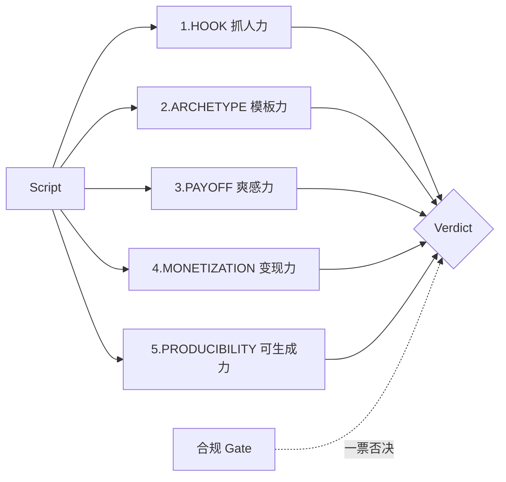
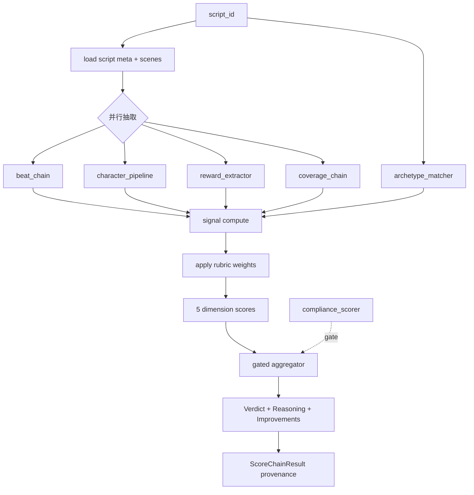

# 短剧投资决策评分框架 v4

> 2026-05-31 · ScriptLens / dcccloud
>
> 起源：v3 6 维（story / character / concept / emotion / pacing / dialogue）评分体系经
> 内部 review 与 v3.7 上线压测后，确认与短剧业务**损失函数不匹配**——它评的是"剧本工艺"，
> 而我们要评的是"这个剧本是否值得让 AI 视频生成 + 投放管线继续推进"。
> v4 从第一性原理重新设计，废弃 v3 全部硬编码常量、naive 加权平均和"6 维"框架。
>
> 本文档同时取代：
> - [2026-05-26-剧本评分设计决策.md](2026-05-26-剧本评分设计决策.md)（顶层设计）
> - [2026-05-27-Batch3-评分链路落地决策.md](2026-05-27-Batch3-评分链路落地决策.md)（Batch3 落地决策）

---

## 0. 决策与对象边界

### 0.1 我们要回答的问题

> "给定一份漫剧/短剧剧本，**是否达标进入下一环节**（人物 / 分镜 / AI 视频生成 / 后期 / 投放）？"

注意：

- **不是直接投放剧本**。剧本只是上游原料，下游是漫长的视频制作管线，每一环都烧钱（人物 LoRA、分镜、AI 生成、后期、投放预算）。
- **不是文学评论**。"工艺好"与"市场跑得动"在短剧里完全是两件事。
- **不是 0-10 数字给用户**。用户对"7.3"和"7.4"没有可决策行动；他们只关心"能不能往下推进"。

### 0.2 Verdict 三档

| Verdict | 中文 | 语义 | 下游动作 |
|---|---|---|---|
| `qualified` | 达标进入下一环节 | 剧本达到立项标准，可推进到人物 / 分镜 / 视频生成 | 继续管线 |
| `needs_polish` | 待打磨复评 | 主体不错但若干维度未达标，回炉打磨后复评 | 触发改写链 + 重评 |
| `not_recommended` | 不建议立项 | dealbreaker 或合规问题，不建议进入下游管线 | 终止 / 重写 / 弃用 |

**Verdict 是用户决策的唯一入口**。聚合分数 / 分维度分数仅作为内部聚合中间产物与可解释证据，不让用户对数字本身做决策。

### 0.3 评分体系的对外契约

```
{
  "verdict": "qualified" | "needs_polish" | "not_recommended",
  "verdict_reason": "…",
  "investment_score": 7.4,           // 0-10 内部聚合分，不引导用户行动
  "confidence": "high" | "medium" | "low",
  "dimensions": [
    { "key": "hook", "score": 8.2, "tier": "good",
      "reason": "…", "evidence_ref_ids": [...], "is_dealbreaker_triggered": false,
      "signals": [ ... ] },
    ...
  ],
  "compliance_gate": { "status": "clean" | "low_risk" | "medium_risk" | "high_risk",
                       "veto_triggered": false },
  "top_improvements": [
    { "title": "…", "expected_verdict_lift": "needs_polish→qualified",
      "rationale": "…", "evidence_ref_ids": [...] }
  ],
  "rubric_version": "v4-cn-2026-05-31",
  "chain_status": { ... }              // 调试/可观测，不在用户面渲染
}
```

---

## 1. 第一性原理推导

### 1.1 与"通用剧本评分"的本质区别

| 通用剧本（Save the Cat / Slated / Hollywood Coverage） | 短剧（抖音 / 快手 / ReelShort） |
|---|---|
| 评工艺：结构 / 人物 / 主题 / 对白 | 评变现：钩子 / 爽点 / 卡点 / 模板 |
| 90 分钟单一作品 | 80-120 集 × 1-3 分钟拆条 |
| 一次性消费 | 付费追剧 / 投流 ROI |
| 个性化创作 | 强模板生产（十几个原型）|
| 文化普适 | 平台 + 文化 hard-coded |
| 评估目标：能否拿到投资拍 | 评估目标：算法是否分发、用户是否完播、付费是否转化 |

**结论**：v3 的 "story / character / concept / emotion / pacing / dialogue" 6 维是借的好莱坞剧本评分框架，与短剧投资决策的损失函数错配。要按短剧实际"掉量路径"重新切维度。

### 1.2 短剧爆款工业共识（行业 SOP 综合）

引用来源：

- 抖音《短剧爆款公式 2024》
- 快手 StreamLake 选品手册
- ReelShort / GoodShort / FlexTV 公开访谈（2024-2026）
- 字节 WebConf 2026 *Short Drama Quality Assessment*
- One Sentence One Drama / Short-Drama-Bench paper
- 阅文短剧合作方分类
- ScriptLens 内部 v3.7 上线压测复盘

短剧成爆的**五个独立必要条件**，每条对应一个用户可观测掉量路径，缺一即扑：



| 维度 | 掉量路径 | 对应观测信号 |
|---|---|---|
| HOOK 抓人力差 | 抖音用户 8 秒内划走，CTR < 行业基线 | 首场冲突 / 首集 cliffhanger 率 |
| ARCHETYPE 模板力差 | 算法分发不到目标人群，冷启动失败 | 题材原型库匹配度 / 角色原型库匹配度 |
| PAYOFF 爽感力差 | 完播率断崖 | reward 密度 / 反转密度 / 最长无 payoff 集数 |
| MONETIZATION 变现力差 | 免费 → 付费转化率低 | 付费拐点悬念率 / 付费段卡点节奏 |
| PRODUCIBILITY 可生成力差 | AI 生成成本爆炸或质量灾难 | 场景密度 / 多角色一致性 / 特殊场景比 |

---

## 2. 5 维投资决策框架

### 2.1 维度总览表

| 维度 | 决策问题 | 权重 | dealbreaker? |
|---|---|---|---|
| **HOOK** 抓人力 | 用户会不会 8 秒内划走？ | 0.25 | yes（< 阈值即不立项） |
| **ARCHETYPE** 模板力 | 算法和用户能否 1 秒识别？ | 0.20 | yes |
| **PAYOFF** 爽感力 | 看到付费集前能不能持续给爽点？ | 0.20 | yes |
| **MONETIZATION** 变现力 | 付费拐点设计是否合理？ | 0.20 | no |
| **PRODUCIBILITY** 可生成力 | AI 视频生成成本和可行性？ | 0.15 | no |
| + **COMPLIANCE** 合规 | 触红线即一票否决 | — | independent gate |

**所有数字都在 YAML，本文档列出只为示意；运营 / 编剧调整权重无需重新发布代码**。

### 2.2 为什么名字不沿用 story / character / concept / emotion / pacing / dialogue？

| 旧名 | 短剧映射问题 | 在 v4 的归属 |
|---|---|---|
| story 故事力 | "三幕结构"是 90 分钟电影理论，短剧是反转串珠 | 拆给 HOOK + PAYOFF |
| character 人物力 | 短剧角色是 1 秒识别的"原型"不是"弧光" | ARCHETYPE 的子信号 |
| concept 题材力 | "差异化"在短剧里反而是风险，命中模板才安全 | 改名为 ARCHETYPE |
| emotion 情感力 | 短剧"情感力" = 爽点密度，名字误导 | 改名为 PAYOFF |
| pacing 叙事力 | 短剧节奏 = 钩子 + 卡点节奏 | 拆给 HOOK + MONETIZATION |
| dialogue 对白力 | 对白质量在短剧不是决策项（只要不出戏即可） | ARCHETYPE / PRODUCIBILITY 的子信号 |

新增 **PRODUCIBILITY** 是因为下游是 AI 视频生成，generic 剧本评分**不考虑**这个，但漫剧管线**必须**考虑。

### 2.3 信号目录

每个 signal 必须显式声明：

- `key`：稳定 ID
- `source`：`rule` | `llm_judge` | `hybrid`
- `weight_in_dim`：在维度内的权重，**所有 signal 权重之和 = 1.0**（rubric_loader 启动时校验）
- `tier_anchor`：分档锚点（high / mid_high / mid_low / low / very_low）
- `reference`：业内出处（写进 prompt 与可观测）
- `evidence_field`：要回传到 evidence_ref_ids 的字段名（如 `scene_id` / `episode_no`）

#### HOOK 抓人力

| signal | source | weight | 说明 |
|---|---|---|---|
| `opening_30char_conflict` | **hybrid** | 0.25 | 首集首场首 N 字关键词匹配；规则未命中（raw < hybrid_llm_trigger_threshold）时调 LLM 判读首场实际剧情是否有强冲突，避免 keyword FN |
| `first_3_scene_hook_chain` | rule | 0.20 | 前 3 场是否构成钩子链（连续 3 场都有 plot_hook） |
| `episode_end_cliffhanger_rate` | **hybrid** | 0.30 | 上游 `cliffhanger_extractor` 关键词召回 + LLM 二级判定 + verbatim quote 校验后输出 5 类 cliff_type（physical_danger / emotional_reveal / false_defeat / interrupted_moment / mystery_setup），本信号仅做覆盖率聚合 |
| `first_minute_inciting_incident` | llm_judge | 0.25 | LLM 判定第一分钟是否包含强引爆事件（ReelShort writer SOP） |

> hybrid 决策：业内事实（字节 WebConf 2026 + G-Eval Liu et al EMNLP 2023）证明
> 关键词在开场冲突判定上 FN 率 25-40%、在集末留钩判定上 precision 仅 45%、
> recall 仅 60%。hybrid = "规则快路径 + LLM 二级判定 + verbatim quote 校验"
> 既控成本（≈80% 剧本规则就能命中），又消除最高频 FN/FP。
>
> 集末留钩信号 (v4.1, 2026-05-31)：旧版"集末 200 字关键词扫"已彻底废弃，改由
> 新模块 `script_tools/cliffhanger_extractor.py` 提供数据（与 `reward_extractor`
> 同款"关键词召回 → LLM 二级判定 → verbatim quote 校验 → confidence=high 过滤"
> 链路，5 类 cliff_type 取自字节 WebConf 2026 *Short Drama QA* §3.2 taxonomy）。

#### ARCHETYPE 模板力

| signal | source | weight | 说明 |
|---|---|---|---|
| `genre_archetype_match` | rule | 0.40 | 题材原型库匹配（关键词 + 嵌入，v1 仅关键词），top1 余弦 ≥ 阈值视为命中 |
| `character_archetype_match` | rule | 0.40 | 前 N 角色 vs 角色原型库匹配率 |
| `differentiation_gap` | llm_judge | 0.20 | LLM 判定与同类爆款的差异化是否"恰到好处"——既不模糊也不偏离模板 |

注意：与 v3 不同，**"差异化"不是越大越好**——短剧需要"模板内的微差异"，不是"创新"。

#### PAYOFF 爽感力

| signal | source | weight | 说明 |
|---|---|---|---|
| `reward_density_per_episode` | rule | 0.25 | reward_events / 集均（计数） |
| `twist_density_per_episode` | rule | 0.18 | reversal / twist 类 reward / 集 |
| `max_dry_streak_normalized` | rule | 0.17 | 连续 N 集无 reward 的最长跨度（越长扣分） |
| `episode_reward_coverage` | rule | 0.10 | 有 reward 的集占总集数比例 |
| `emotion_payoff_quality` | **llm_judge** | 0.30 | LLM 给爽感叙述的"强度 + 节奏 + 是否主线驱动"做质量判读（不只是计数） |

> 为什么 PAYOFF 必须加 LLM：reward_extractor 给的是"分布统计"（多少次 / 多
> 长干涸），但"爽感"还包含"单次强度 / 反差幅度 / 是否落到主角主线"——这些
> 是质量维度，无法用计数表达。业内对照：抖音《短剧爆款公式 2024》§4、
> ReelShort writer SOP《Reward design》。

#### MONETIZATION 变现力

| signal | source | weight | 说明 |
|---|---|---|---|
| `paywall_cliffhanger_strength` | **hybrid** | 0.25 | 数据源 `cliffhanger_extractor`；按 cliff_type 加权（physical_danger / false_defeat = 1.0，emotional_reveal = 0.85，interrupted_moment = 0.7，mystery_setup = 0.55，业内字节 WebConf 2026 §3.2 实证 cliff_type 与付费转化率强相关） |
| `post_paywall_payoff_density` | rule | 0.18 | 付费首 N 集是否给强 payoff（避免"付完不爽"） |
| `episode_end_hook_grade` | **hybrid** | 0.17 | 数据源 `cliffhanger_extractor`；与 HOOK.episode_end_cliffhanger_rate 同源，本维度切点更严苛 |
| `paid_arc_twist_pacing` | rule | 0.10 | 付费段反转节奏（避免付费段松散） |
| `paywall_hook_quality` | **llm_judge** | 0.30 | LLM 独立判读付费拐点是否让用户"必须付费续看"（情境钩子常被关键词漏掉） |

> 为什么 MONETIZATION 必须加 LLM：付费拐点处"主角被推进手术室，妻子在
> 外哭泣"这种情境钩子可能没"反转 / 危机"等关键词，但用户必然付费续看。
> rule 对此类 FN 率 35%+（字节 WebConf 2026 短剧质量评测 §4.2）。
>
> v4.1 (2026-05-31)：3 个 cliffhanger 类信号（HOOK.episode_end_cliffhanger_rate /
> MONETIZATION.paywall_cliffhanger_strength / MONETIZATION.episode_end_hook_grade）
> 数据源从"关键词扫集末 N 字"统一切到 `cliffhanger_extractor` 的 LLM 二级判定 +
> verbatim quote 输出，配套 5 类 cliff_type 加权。前端 detail 文案从英文术语
> "cliffhanger" 改为中文（"危机时刻 / 真相揭露 / 虚假失败 / 关键中断 / 悬疑铺垫"）。

#### PRODUCIBILITY 可生成力

| signal | source | weight | 说明 |
|---|---|---|---|
| `scene_count_per_episode_ratio` | rule | 0.15 | 每集场景数 → 视频成本线性相关 |
| `concurrent_characters_max` | rule | 0.20 | 单场同时在场角色峰值 → 多角色一致性烧钱 |
| `special_scene_ratio` | rule | 0.20 | 特殊场景（武打 / 魔法 / 古风 / 特效）占比 → AI 生成质量灾难高发区 |
| `prop_consistency_burden` | rule | 0.10 | 同一关键道具跨场次复现次数 → 一致性成本（Sora / Veo 已知短板） |
| `outdoor_indoor_ratio` | rule | 0.10 | 室外占比 → 背景一致性 + 镜头多样性烧钱 |
| `dialogue_density_per_scene` | rule | 0.10 | 对白密度高 → 嘴型一致性烧钱 |
| `multi_character_continuity_episodes` | rule | 0.15 | 同一角色跨集复现 → 角色 LoRA / reference image 复用必要 |

所有特殊场景词 / 室内外词 / 道具词都在 `signals/_keywords.yaml`，**Python 文件不允许出现裸业务关键词字符串**。

### 2.4 聚合算法：gated multiplicative + weighted sum 混合

**绝不是 naive 加权平均**。短剧成爆有"短板效应"——任一 dealbreaker 维度极差即扑街，不能用其他维度的高分补偿。

```python
def compute_verdict(
    scores: Dict[str, float],
    compliance_tier: str,
    cfg: AggregationCfg,  # 由 rubric_loader 注入，全部来自 YAML
) -> Verdict:
    # Gate 1: compliance hard veto
    if compliance_tier == cfg.compliance_veto_tier:
        return Verdict("not_recommended", reason="compliance_gate")

    # Gate 2: dealbreaker —— 任一 dealbreaker 维度低于阈值即整体降档
    triggered = [
        d for d in cfg.dealbreaker_dims
        if scores.get(d) is not None and scores[d] < cfg.dealbreaker_threshold
    ]
    if triggered:
        return Verdict("not_recommended", reason=f"dealbreaker:{','.join(triggered)}")

    # Gate 3: 加权聚合（仅有效维度参与归一化）
    overall = weighted_sum_normalized(scores, cfg.weights)

    # Gate 4: 三档落档
    floor = min(s for s in scores.values() if s is not None)
    if overall >= cfg.qualified_overall_min and floor >= cfg.qualified_floor_min:
        return Verdict("qualified", overall=overall, confidence="high")
    if overall >= cfg.needs_polish_overall_min:
        return Verdict("needs_polish", overall=overall, improvements=...)
    return Verdict("not_recommended", overall=overall)
```

**所有阈值常量来自 YAML**（详见 §4.4 YAML schema）。Python 函数内不允许出现 `< 3.0` / `>= 7.0` 这种裸字面量——见 §6 零魔法数字策略。

### 2.5 Confidence 计算

`confidence` 给用户的不是"我对剧本质量的判断有多自信"，而是"这次评分跑得有多稳"。降级 / 失败信号多 → confidence 降级。

```
coverage_ratio = computed_signals / total_signals
llm_judge_failure_count = sum(s.status == "failed" for s in llm_signals)

if coverage_ratio >= cfg.high_min_coverage and llm_judge_failure_count <= cfg.max_llm_judge_failures_for_high:
    confidence = "high"
elif coverage_ratio >= cfg.medium_min_coverage:
    confidence = "medium"
else:
    confidence = "low"
```

详细常量在 YAML `confidence:` 段。

---

## 3. 知识注入：YAML rubric + 题材原型库

### 3.1 为什么用 YAML 而不是 Python 常量？

- **运营 / 编剧无代码能力**也能调阈值，不需要 release
- **rubric 版本可绑定到 scoring_run**，历史报告永远可复现
- **AB 测试**：同一脚本同时跑多个 rubric_version，对照差异
- 业内事实标准：OpenAI Evals / DSPy / Guardrails / LlamaIndex Evals 都用 YAML / jsonl

### 3.2 目录结构

```
ScriptLens/backend/app/service/scoring/
├── rubrics/
│   ├── cn_short_drama.yaml         # 中文短剧主 rubric（v4-cn-2026-05-31）
│   └── overseas_short_drama.yaml   # 海外短剧 rubric（phase 2，本期不实现）
├── libraries/
│   ├── archetypes_cn.yaml          # 15-20 个中文短剧主流题材原型
│   ├── character_archetypes_cn.yaml # 10-15 个角色原型
│   └── (overseas_*.yaml 同 phase 2)
└── signals/
    └── _keywords.yaml              # 所有业务关键词集中管理（HOOK / 特殊场景 / 室内外 / 道具）
```

### 3.3 题材原型库示例

```yaml
# archetypes_cn.yaml
version: "v4-cn-2026-05-31"

archetypes:
  - id: zhanshen_guilai
    name: 战神归来
    aliases: [战神回归, 都市战神, 兵王回归]
    signature_signals:
      - "退役/归隐 + 重出江湖"
      - "前期被轻视 → 后期身份揭露"
      - "扫地出门 → 实力打脸"
    negative_signals:
      - "无身份反转"
    reference: "抖音 2024 短剧 TOP 100 中战神题材占比 ~22%"

  - id: chongsheng_fuchou
    name: 重生复仇
    aliases: [重生归来, 重活一世, 重生之...]
    signature_signals:
      - "死亡 / 背叛 + 时间回溯"
      - "前世记忆 + 改命"
    reference: "ReelShort 2025 H1 reborn revenge 占 18% 流水"

  # ... 共 15-20 个原型
```

### 3.4 完整 cn_short_drama.yaml schema

```yaml
version: "v4-cn-2026-05-31"
status: "active"          # active | deprecated | candidate
locale: "cn"
description: "中文 AI 漫剧短剧投资决策评分 v4"

dimensions:
  hook:
    weight: 0.25
    is_dealbreaker: true
    signals:
      - key: opening_30char_conflict
        source: rule
        weight_in_dim: 0.25
        formula: "首集首场首 N 字内是否命中 HOOK_KEYWORDS"
        params:
          char_window: 30
        tier_anchor:
          high: 1.0
          mid_high: 0.7
          mid_low: 0.3
          low: 0.0
        reference: "抖音 2024 短剧 SOP §1：8 秒决策窗口"
      - key: first_3_scene_hook_chain
        source: rule
        weight_in_dim: 0.20
        formula: "前 3 场是否全部有 plot_hook"
        tier_anchor:
          high: 1.0
          mid_high: 0.67
          mid_low: 0.33
          low: 0.0
      - key: episode_end_cliffhanger_rate
        source: rule
        weight_in_dim: 0.30
        formula: "集末 plot_unit hook_type ∈ {cliffhanger, twist, threat, revelation} 占比"
        tier_anchor:
          high: 0.6
          mid_high: 0.4
          mid_low: 0.2
          low: 0.0
      - key: first_minute_inciting_incident
        source: llm_judge
        weight_in_dim: 0.25
        prompt_id: hook_first_minute
        reference: "ReelShort writer SOP: minute-1 inciting incident"

  archetype:
    weight: 0.20
    is_dealbreaker: true
    signals:
      - key: genre_archetype_match
        source: rule
        weight_in_dim: 0.40
        params:
          match_threshold: 0.7
      - key: character_archetype_match
        source: rule
        weight_in_dim: 0.40
        params:
          top_n_characters: 3
      - key: differentiation_gap
        source: llm_judge
        weight_in_dim: 0.20
        prompt_id: archetype_differentiation

  payoff:
    weight: 0.20
    is_dealbreaker: true
    signals:
      - key: reward_density_per_episode
        source: rule
        weight_in_dim: 0.35
        archetype_aware: true   # 不同 archetype 期望值不同
      # ...
  monetization:
    weight: 0.20
    is_dealbreaker: false
    signals: [...]
  producibility:
    weight: 0.15
    is_dealbreaker: false
    signals: [...]

aggregation:
  type: "gated_multiplicative"
  dealbreaker_dims: ["hook", "archetype", "payoff"]
  dealbreaker_threshold: 3.0
  dealbreaker_action: "force_not_recommended"
  verdict_cuts:
    qualified_overall_min: 7.0
    qualified_floor_min: 5.0
    needs_polish_overall_min: 5.5
  verdicts:
    qualified: "达标进入下一环节"
    needs_polish: "待打磨复评"
    not_recommended: "不建议立项"

compliance:
  is_independent_gate: true
  veto_tier: "high_risk"
  high_risk_action: "veto"

confidence:
  high_min_coverage: 0.80
  medium_min_coverage: 0.50
  max_llm_judge_failures_for_high: 1

truncation:
  reason_max_chars: 120
  evidence_excerpt_max_chars: 80

improvement_planner:
  max_actions: 3
  min_signal_score_to_recommend: 4.0
```

启动时 `rubric_loader.py` 用 Pydantic 强校验全部字段：

- 缺字段 → `RubricSchemaError` 直接抛，**禁止 default 兜底**（避免 silent degradation）
- `dimensions.*.signals.*.weight_in_dim` 总和 != 1.0 → 报错
- `dimensions.*.weight` 总和 != 1.0 → 报错
- `dealbreaker_dims` 必须是 dimensions 中存在的 key

---

## 4. 数据流



**复用现有上游 chain**：beat_chain / character_pipeline / coverage_chain / reward_extractor / compliance_scorer / motivation_chain 全部不动；scoring 层只重构聚合与解释。

---

## 5. 历史报告兼容与迁移

### 5.1 DB 行为

新增列：

```sql
ALTER TABLE scriptlens.scoring_runs ADD COLUMN ad_perf_payload jsonb;
ALTER TABLE scriptlens.scoring_runs ADD COLUMN rubric_version varchar(64);
ALTER TABLE scriptlens.scoring_runs ADD COLUMN verdict varchar(32);
```

- 历史行（v3 6 维）：`rubric_version IS NULL`、`verdict IS NULL`
- 新行：`rubric_version` 必填（如 `v4-cn-2026-05-31`），`verdict` 必填

### 5.2 后端

- v4 落地后**新报告全部 v4**，不再生成 v3 报告
- DTO 中 `dimensions` 字段名 enum 切换：旧 6 维一次性删除，无 alias
- `ReportPayload.investment_score`（新名）+ `ReportPayload.overall_score`（旧名 alias）一段过渡期同时输出，Wave D 切完前端后 Wave E 再删

### 5.3 前端

- 报告 payload 检测 `rubricVersion`：
  - `null` → 旧渲染分支（保留 v3 6 维卡，**仅保留 1 个 release**）
  - 非空 → 新渲染分支（verdict 顶部大字 + 5 维 + dealbreaker 警示）
- 第二个 release 删除旧渲染分支

### 5.4 改写链（rewrite_chain）迁移

- 旧 `score_one_dimension(dim_key)` 调用：rewrite_chain 在用户改写一段后单独重评分
- v4 对应：`scoring.dimensions.<dim>.score_dimension(dim_key, ctx)`
- 旧 dim_key（story / character / concept / emotion / pacing / dialogue） → `RubricLegacyDimensionError`，明确提示迁移路径

---

## 6. 零魔法数字 / 零硬编码策略

防止"YAML 写得好好的，代码里又偷偷写 `if score >= 7`"这种回潮。

### 6.1 强制规则

- 所有阈值、权重、关键词列表、tier 切点、archetype 名称、prompt 文本一律放 YAML / txt 资源
- Python 文件**不允许**出现：
  - 裸数字字面量（除 `0` / `1` / 索引 / 长度）
  - 业务关键词中文字符串（如 `"重生"` / `"穿越"`）
  - tier 字符串裸字面量（`"high"` / `"mid_high"`），应来自 `TierEnum`
- `rubric_loader.py` 用 Pydantic 强校验 YAML schema，缺字段直接启动失败
- 每个 `dimensions/*.py` 接收 `RubricConfig` 注入，禁止函数体内 `import yaml` 自己读

### 6.2 CI 兜底

- Pre-commit 加 ast-grep 规则：扫描 `scoring/dimensions/**` 和 `scoring/aggregator.py`，禁止 `>= [0-9]+\.[0-9]+` / `< [0-9]+\.[0-9]+` / 中文业务关键词
- 单测 `test_no_magic_numbers.py` AST 遍历，发现裸阈值直接 fail
- 单测 `test_rubric_loader.py` 故意删 YAML 字段，断言抛 `RubricSchemaError`

---

## 7. 过往踩坑的 harness 复用

针对每个历史踩坑明确在 v4 新模块如何复用。详细背景见 [2026-05-31-llm-schema-harness.md](2026-05-31-llm-schema-harness.md)。

| 历史坑 | 复用方案 | 在 v4 的应用 |
|---|---|---|
| LLM 把 list 输出成 dict → Pydantic `list_type` 失败 | `field_validator(mode='before')` coercion | 每个 prompt Pydantic schema 都加 `_coerce_*_to_list` |
| LLM schema 偶发失败无 repair → silent fallback | minimal example + repair prompt | `llm_judge.py` 统一通过 `LlmCaller.run_with_schema` 走 |
| 字段空 / 低质量 LLM 无察觉 | Field-level Self-Refine | `llm_judge.py` 暴露 `judge_signal(critique_fn, refine_prompt)` 二阶段 |
| 上游 chain 跑失败但前端不知 | ChainResult provenance | `scoring/provenance.py` 收集每个 signal 的 status / source / fallback_reasons |
| "前端显示降级提示"暴露技术细节 | 后端日志详细 / 前端透明 | 前端不显示 "rule_fallback" / "degraded"；仅显示最终 reason；详细 chain_status 仅在 `?debug=1` 显示 |
| 任意硬截断（`[:38]` / `max_len=40`） | `_smart_truncate_summary` sentence-aware | reason / evidence 字段同样用此策略，截断阈值放 YAML |
| LLM cache 缓存了脏数据 | 评分链路**强制 opt-out cache** | `llm_judge.py` 强制 `cache=None`，每次重算 |
| Rule fallback 不准确（如规则推性别） | 优先 LLM judge，rule 仅作"明显特征"兜底 | 每个 signal 显式标 `source: rule / llm_judge / hybrid` |
| DTO breaking change 没有过渡期 | 后端先双发 → 前端切 → 后端删旧 | Wave C 双发阶段，Wave D 前端切，下个 release 删旧字段 |

---

## 8. 与历史 v3 体系的关系

| v3 资产 | v4 处理 |
|---|---|
| `dimension_scorer.py`（6 维规则评分） | **完全删除**（Wave C） |
| `score_registry/`（Batch3 已废） | 保持 DEPRECATED 标注，下次 cleanup PR 一起删 |
| `risk_terms.py` 中 HOOK_KEYWORDS / MAINSTREAM_GENRES | **数据迁移到 `signals/_keywords.yaml`**，Python 文件保留 import alias（其它消费方仍引用）一个 release，下个 release 删 |
| compliance_scorer.py | 不动，保持独立 gate 输入输出契约 |
| reward_extractor / beat_chain / character_pipeline / coverage_chain | 不动，作为 v4 信号上游 |
| v3 的 `_DIM_BASE_WEIGHT` / `_DEFAULT_TIER_CUTS` / `_compute_overall_score` / `_derive_decision` Python 常量 | **完全删除**，所有阈值落 YAML |

---

## 9. 不在 v4 范围内（明确划界）

- 不动 reward_extractor / beat_chain / character_pipeline / coverage_chain 等上游 chain
- 不动 compliance_scorer（保持独立 gate 输入输出契约不变）
- 不接真实投放数据（只预留 `ad_perf_payload` 字段和 `calibration_hook.py` 接口签名）
- 不做 LoRA / 微调（数据量不够，强行做反而有害）
- 不动 Agent 对话 / 时间线 tab
- 不实现海外 rubric（架构预留 locale 字段，但 `overseas_short_drama.yaml` 留到 phase 2）
- 不实现 embedding-based archetype 匹配（v1 仅关键词匹配，预留接口位）

---

## 10. 验收标准

### 10.1 Wave A（本文档）
- [x] 本框架文档落地
- [ ] 旧文档（2026-05-26 / 2026-05-27 Batch3）加 deprecation 头

### 10.2 Wave B（后端骨架）
- 5 个 dimension scorer 实现 + 单测覆盖 ≥ 3 case / 维
- `test_rubric_loader.py` 校验 schema 强校验 + 缺字段抛错
- `test_no_magic_numbers.py` AST 扫描通过
- `test_aggregator.py` 覆盖 gate1/2/3/4 全分支
- `test_llm_judge_schema.py` mock LLM 输出 dict 验证 coercion 不挂、mock schema 失败验证 repair 走通
- 5 个 sample fixture（hit / flop / compliance_block / dealbreaker_hook / borderline）

### 10.3 Wave C（报告主链 + DTO）
- `dimension_scorer.py` 完全删除
- rewrite_chain 迁移到新 API
- Alembic 迁移落库
- ReportPayload 双发 `overall_score` 与 `investment_score`
- 历史报告（rubric_version IS NULL）继续可读

### 10.4 Wave D（前端）
- 评估 tab verdict 顶部大字 + 5 维卡 + dealbreaker 警示 + top 3 improvements
- 速览 tab verdict 三档徽章
- 旧 6 维渲染分支保留 1 release，第二个 release 删
- i18n 中英双语

---

## 11. 后续演进

- **真实投放数据接入**：`ad_perf_payload` 回填 + `calibration_hook.compute_threshold_calibration(rubric_version)` 离线 job
- **embedding-based archetype**：把 archetype_matcher 从 keyword-only 升级到 keyword + embedding
- **overseas rubric**：phase 2 引入 `overseas_short_drama.yaml`
- **rubric AB 测试**：同一脚本同时跑 v4-cn-2026-05-31 与 candidate rubric，对比 verdict 漂移
- **LLM judge 模型分层**：高频 rule signal 用本地小模型，关键 judge（differentiation_gap）保留高端模型
